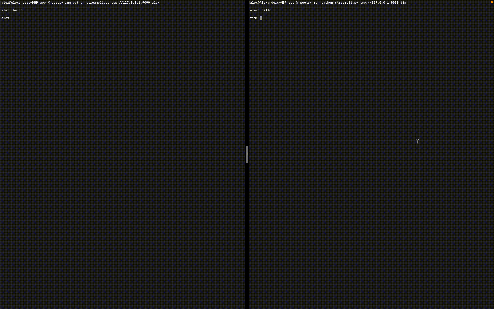

# Chatroom With Cloud Native Streaming

So, recently I built a fun little FastAPI Chatroom utilizing websockets, and I loved it.
However, I was thinking about websockets and about how much research has gone into
streaming services within the last few years. Are websockets really still the way to go?
If they arent, what new tools are out there to help facilitate that process?

I have used Kafka before and I was vaguely familiar with RabitMQ, but what else is there?!

So I took to the CNCF Sandbox to see if I could find something new to play around with. Something
with storage, an easy interface, and hopefully some python bindings that I could hook into
relatively easily. I found two extremely tempting streaming services in the CNCF sandbox that seemed to fit that bill:

* [Pravega](https://www.cncf.io/projects/pravega/)
* [Tremor](https://www.cncf.io/projects/tremor/)

I landed on Pravega because it was extremely easy to get up and running, has a standalone and 
distributed mode, seems to have some incredible efficiency, and has auto-scaling (I'm an SRE 
and a sucker for auto-scaling). There are a ton of other neat feature as well that I encourage you
to check out.

So, why a chatroom? Well, as soon as I send a message, a user should
be alerted of the message and then have the ability to respond. To me, that sounds like
a perfect use case for an event-based or streaming system! So, let's get started.

# Pravega
What is Pravega? Pravega is an open-source streaming and storage utility which promises
unbeatable performance, long-term storage, and autoscaling. Doesn't that sound perfect for
a chatroom?

In our chatroom, we are going to use it in lieu of basic sockets, websockets, 
or other popular chatroom mediums.

## Running Pravega
There are multiple ways to run Pravega, but I chose to just run it as a standalone container.
There are also many ways to configure Pravega, such as distributing separate pieces of it across
different containers for reliability purposes (which is what I recommend in a production system).
However, we are just going to run it in standalone mode for ease:

```shell
docker run -it \
  -e HOST_IP=0.0.0.0 \
  -p 9090:9090 \
  -p 12345:12345 \
  pravega/pravega:latest \
  standalone
```

Thats it, you'll now see pravega running in a terminal and it's ready to accept connections!

# StreamCli
StreamCli is what we're going to call our python app. It's going to be an easy-to-run
cli which connects to a pravega broker in both a read and write capacity. I was also inspired
by slack to include some sort of "slash-commands" to help minimize the typing we had to do 
for common tasks (greetings, jokes, etc.).

To make all of this happen, we are going to need:

* Something to read from a pravega stream and act upon messages
* Something to take user input and write it to a pravega stream
* Something to manage the reader and the writer

It sounds like a lot, but I promise its quick, easy, and is only like 200 lines of code.

## Reader
Let's start with the reader because it's the most complex. After this, it's all downhill. 
Before actually sending messages, we should agree on a format for messages. That way whatever
is being sent can be properly processed on the receiving end of the stream. For that, we can use 
pydantic models:

```python
from pydantic import BaseModel

class Message(BaseModel):
    sender: str
    message: str
```

This defines a python object which has two string attributes:

* sender: The ID of the sending user
* message: The contents of the message

Pydantic models have a ton of helpers associated with them like:

* json functions
* parsing functions
* much more

Now that we have agreed upon a message format, we can begin writing our reader. Our reader
will need two attributes:

* An ID so it knows who it is receiving for
* A pravega reader instance so it can attach to the stream

The definition and init of it are simple:

```python
class MyReader:
  def __init__(self, p_reader, id):
    """A class which wraps the pravega readers

    Arguments:
      * p_reader: A pravega reader instance
      * id: A unique ID
    """
    self.p_reader = p_reader
    self.id       = id
```

Logically, we need a method to:

* Read from the stream
* Act on the message
* Tell the stream when its done listening (Close the connection)

We can read from the stream by using our pravega instance. Pravega organizes messages
into things called `slices`. A slice is a portion of a segment, which are shards or pieces of
a stream. Once we read that slice from the segment, we need to notify pravega that it has
been processed and shouldn't be processed again by the same reader group. Finally, we
need to process that slice and do something actionable with it. So, in code, our `read` function
looks like:

```python
  async def read(self):
    """Reads next message from the pravega stream. If message
    is non-null, then process it accordingly using helper functions
    """
    try:
        # acquire a segment slice to read
        slice = await self.p_reader.get_segment_slice_async()
        buff  = []
        for event in slice:
          buff.append(event.data())
                
        # after calling release segment, data in this segment slice will not be read again by
        # readers in the same reader group.
        self.p_reader.release_segment(slice)

        # If we got a non-null message, process
        if len(buff) > 0:
          resp = await self._process_message(buff)
          return resp
    except Exception as e:
      logging.error(str(e))
```

Notice that we first read a slice from the segment using `get_segment_slice_async`. Once
we read all of the data from the segment, we then let Pravega know that this reader group 
has processed the message and doesn't need to be processed again by this reader group with
`release_segment`. Finally, we process the message with `_process_message` (more on that soon).

Now that we have read a message, we need to do something actionable with it. This is where the 
`_process_message` comes in to play. Logically, our `_process_message` function will have to:

* Parse the message from its format to our message format
* Process it somehow
* Show it to the receiving user

It's worth noting that I wanted to add 2 special commands into my chat system:

* The keyword `greet` should greet the user by saying `<Sending User> says hi!`.
* The keyword `joke` should tell the receiving user a random joke

So our `_process_message` function becomes:

```python
  async def _process_message(self, buff):
    """Processes incoming messages and then decides what 
    to do with them. At the time, the only commands recognized
    are greet and joke. These are akin to slash commands in slack.

    Arguments:
      * buff: A buffer of bytes read from the pravega stream
    
    Returns:
      * resp: A response message to be printed to the console
    """

    # Decode all of the byte strings into regular strings
    decoded   = [x.decode("utf-8") for x in buff]
    stringify = "".join(decoded).strip().lower()
    jsonify   = json.loads(stringify)
    # set to a message so we can ensure it fits the required format
    incoming  = Message(sender=jsonify['sender'], message=jsonify['message'])

    # because we are also listening, we dont want to respond to our own messages
    if (incoming.sender == self.id):
      return
    
    message = jsonify['message']

    # Decide what to do with the commands
    if (message == "greet"):
      msg = await self._greet(incoming.sender)
    elif (message == "joke"):
      msg = await self._tell_joke()
    else:
      msg = message

    resp = Message(sender=incoming.sender, message=msg)
    return resp.dict()
```

Notice how we first load the message from the json format it will be sent as (discussed below)
into our desired message format. Next, because we are reading and writing to a stream, we want to 
make sure we aren't writing to ourselves. Finally, we process the message utilizing our desired
format and return to our caller. For completeness, the `_tell_joke` and `_greet` function are 
shown below:

```python
  async def _tell_joke(self):
    f = "https://official-joke-api.appspot.com/random_ten"
    data = requests.get(f)
    tt = json.loads(data.text)[0]
    return tt["setup"] + "\n" + tt["punchline"]

  async def _greet(self, sender):
    return f"{sender} says hi!"
```

Finally, we do need a close method which tells pravega "this listener is done and will
be removed from the chatroom!":

```python
  async def close(self):
    """Close the reader on the pravega stream to avoid dangling
    readers
    """
    self.p_reader.reader_offline()
```

And that's it! We now have an object which can read from a stream and perform semi-intelligent
actions based on the messages it receives from the stream.

## Writer
The writer is much simpler than the reader. It needs two pieces of information:

* Its ID
* A Pravega writer instance

Its definition and init are below.

```python
class MyWriter:
  def __init__(self, p_writer, id):
    """A class which wraps the pravega writers

    Arguments:
      * p_writer: A pravega writer instance
      * id: A unique ID
    """
    self.p_writer = p_writer
    self.id       = id
```

It really only needs one or two methods:

* One to frame a message
* One to send the message

Let's look at how to frame a message.

```python
  def _format_message(self, message):
    """Format the message to the Message format defined
    for our system

    Arguments:
      * message: Text content of the message in question

    Returns:
      * json: Json representation string to be put on the pravega stream
    """
    msg = Message(sender=self.id, message=message)
    return msg.json()
```

So, looking at this, we just create a pydantic model (called Message) and input
the required information. Finally, we return it as a json string to send over the stream.
As a side note, we looked briefly at the Message pydantic model when discussing the reader.

Finally, we can send the message.

```python
  def write(self, message):
    """Writes a message to the pravega stream

    Arguments:
      * message: The message to write to the stream
    """
    msg = self._format_message(message)
    self.p_writer.write_event(msg)
```

We see that we frame our message, and then send it out over the pravega writer instance.

## Chatter
So, we have our readers and we have our writers. To chat, we need to combine
the two into one clean object. We will call that object our Chatter (See definition and
init below):

```python
class MyChatter:
  def __init__(self, reader, writer, id):
    """A class which has a pravega writer, a pravega reader, 
    and an id

    Arguments:
      * reader: A pravega reader instance
      * writer: A pravega writer instance
      * id: A unique ID
    """
    self.reader  = reader
    self.writer  = writer
    self.running = True
    self.id      = id
```

Our chatter object will maintain its reader and writer, and will notify them to close
with the `running` attribute (more on that shortly).

Conceptually, our chatter will need the same functions as its constituents. Namely:

* A read function to tell the reader to do its thing
* A write function to tell the writer to do its thing
* A close function to gracefully terminate its pieces

We also don't want to have blocking system (Forced to read before writing), so we will utilize
different threads for the reader and the writer.

The read function in the chatter object is much simpler than that of the reader object, because
all it has to do is wait for the reader.read method to return, format it, and print it out:

```python
  async def read(self):
    """Continuously listens for new messages from the pravega
    broker
    """
    while(self.running): # Will be set to false when close is called
      msg = await self.reader.read()
      if (msg):
        logging.debug(msg)
        # Backspaces to make it look like the input prompt stays at the 
        # bottom of the screen for easier reading
        print('\b' * (len(self.id) + 2), end="", flush=True)
        # Print the message, and then re-enter the prompt line
        print(f"{msg['sender']}: {msg['message']}\n")
        print(f"{self.id}: ", end="", flush=True)
    # Close the reader after this finishes and the chatter
    # requests a closed connection
    await self.reader.close()
```

You'll notice that when we are finished running (`self.running` is false), we will
automatically close our reader.

The write method is similar in that sense. It just has to take user input and ship it
to the writer:

```python
  def write(self):
    """Continuously listens for new messages from the user to then
    write to the pravega broker
    """
    while(self.running): # Will be set to false when close is called
      print("")
      message = input(f"{self.id}: ").strip().lower()
      if (message):
        self.writer.write(message)
```

Our close method then just has to terminate those loops and the readers will
be closed gracefully:

```python
  def close(self):
    """Tell threads to close themselves and exit gracefully
    """
    self.running = False
```

We can tie all of these pieces together into a nice, concurrent package with threads:

```python
  async def chat(self):
    """Begins the chat read/write threads
    """
    reader_t = Thread(target=asyncio.run, args=(self.read(),))
    writer_t = Thread(target=self.write)
    reader_t.start()
    writer_t.run()
```

If we analyze this a bit further, we:
* create a reader thread. Because read is an async function (so it doesn't block), we need to
  wrap our target with `asyncio`. This thread will be running the asyncronous callback.
* create a writer thread. Writing isnt asyncronous, as we have to wait for user input. So we
  can use the typical and normal thread targets here.
* Start our threads!

## Tying It All Together
Finally, we tie it all together and package it as a CLI. There are a lot of great python argument parsing utilities our there:

* [argparse](https://docs.python.org/3/library/argparse.html)
* [click](https://click.palletsprojects.com/en/8.1.x/)
* [docopt](http://docopt.org/)

And I chose `docopt` for today because its easy to use and takes a lot of the
heavy lifting off of the programmer. `docopt` is going to parse our docstring
and then generate the arguments based off of that. Our docstring looks something like:

```python
"""streamcli

Usage:
  streamcli.py <url> <id> [--verbose]
  streamcli.py --version

Options:
  -h --help                          Show this screen.
  --version                          Show version.
  --verbose                          High Verbosity.

Example:
  streamcli.py tcp://127.0.0.1:9090 tim --verbose 
  streamcli.py tcp://127.0.0.1:9090 alex
"""

```

So `docopt` will parse this, create a dictionary of possible arguments, 
and then we can act on them accordingly.

Our main function does just that. Main will:
* Parse our docstring and analyze user-supplied args
* Create a pravega stream manager, scope, stream, reader, and writer
* Create our reader and writer wrappers
* Create our chatter
* Begin chatting

```python
async def main():
  # Pass our docstring to docopt for parsing
  arguments = docopt(__doc__, version='streamcli 0.1.0')

  log_level = logging.DEBUG if arguments['--verbose'] else logging.INFO

  # set log level based on --verbose flag
  logging.basicConfig(level=log_level)

  # Pull data out of the user passed arguments
  url     = arguments['<url>']
  chat_id = arguments['<id>']

  # Create a stream manager, scope, and stream
  # for the app to use. Will be created each time
  # an app instance is run, but doesnt affect pravega
  stream_manager = pravega_client.StreamManager(url)
  stream_manager.create_scope("scope")
  stream_manager.create_stream("scope", "stream", 2)
  reader_group = stream_manager.create_reader_group(chat_id, "scope", "stream")

  # Create pravega readers, writers, and our wrappers
  reader       = reader_group.create_reader(chat_id)
  my_reader    = MyReader(reader, chat_id)
  writer       = stream_manager.create_writer("scope","stream")
  my_writer    = MyWriter(writer, chat_id)

  # Create chat instance with the reader and writer wrappers above
  chatter = MyChatter(my_reader, my_writer, chat_id)

  # Create scoped function which will be invoked on CTRL+C to
  # gracefully close readers / chatters
  def signal_handler(*args):
    chatter.close()

  signal.signal(signal.SIGINT, signal_handler)

  # Run the chat
  await chatter.chat()
```

The important pieces are the pravega api calls. We first create a StreamManager
with allows us to run some managerial tasks for our pravega cluster. We then create
or use a scope which is similar to a namespace. We then create a stream within that scope
and a reader group within that stream and scope. Each user gets their own reader group
which means that when userA reads from the stream, userB and userC won't be affected. Finally,
we create the individual reader and writer to be able to read and write from the stream
explicitly.

## Running
We are now ready to run!

In one terminal, make sure your pravega docker image is running! If not, you can run
```shell
docker run -it \
  -e HOST_IP=0.0.0.0 \
  -p 9090:9090 \
  -p 12345:12345 \
  pravega/pravega:latest \
  standalone
```

Now, open up two other terminals. In one of them run `python streamcli.py tcp://127.0.0.1:9090 alex` and in the other, run ` python streamcli.py tcp://127.0.0.1:9090 tim` and begin chatting
back and forth!

See the video below!



## References
All code can be found in my public repo [here](https://github.com/afoley587/cloud-native-streaming).
